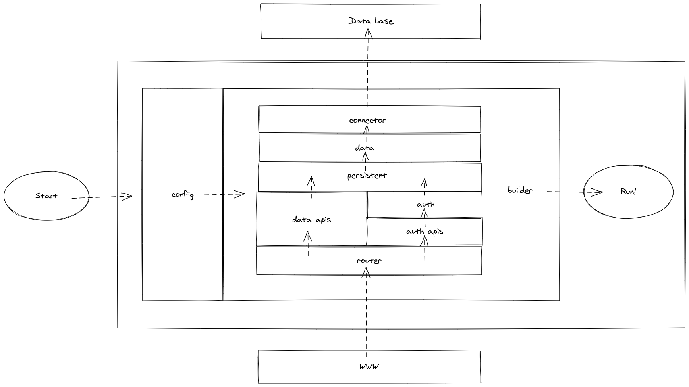

# Documentation

## Database schema

**batches**

- Drugs are acquired in batches

- Drugs in the same batch share the same expiration date.

**drugs**

- Different types of drugs the hospital has.

- Different presentations are considered different drugs.

**fill_batches**

- Outputs caused by a prescription fill

**inputs**

- Drug acquisition

- Can either be by purchase, transfer or other.

- In one input we can obtain multiple batches.

**licenses**

- Different licenses that Doctors have attained through their career

- Can either be professional licenses or specialties.

**outputs**

- Drugs leaving the hospital

- Can either be because they expired, we filled a prescription or other.

- In one output we group drugs of the same batch.

- Needs to be signed by a manager.

**patients**

- The patients at the hospital.

**permissions**

- Ability to perform an action on the API

**prescription_drugs**

- Drugs required in a prescription

- Intake indications.

**prescription_fills**

- Information when a prescription is filled.

**prescription_returns**

- Information when some prescribed drugs are returned

**prescriptions**

- Prescription issued by a doctor to a patient.

**purchases**

- Additional information required if the input is a purchase.

**role_permissions**

- Permissions that a certain role has.

**roles**

- Different roles inside the system.

**specialties**

- Additional information required if the license is a specialty

**transfers**

- Additional information required if the input is a transfer

**user_roles**

- Assignation of users and their roles.

**users**

- Users of the system.

You can see in more detail the relationships [here]('./schema.pdf')

## Database audit
We want to be able to audit changes in the database to track unwanted behaviours
To be able to make this audits, we keep track of all the changes in an entity.
Our solution has two parts:

- Persistent operations, this means to save the current state of an entity before changing it. This operations are handled by the API.

- Metadata of the changes made:
  
  - **created_at** The moment of the last change to this record.
  
  - **created_by** The user responsible of the last change to this record.
  
  - **original_id** Since we are saving snapshots of the entities, these are going to have new ids. This field stores the id of the original object.
  
  - **status**: Either `active` if the records belongs to the current state of the database or `history` if the record belongs to an older state of the database.

[This article](https://www.codeproject.com/Articles/105768/Audit*Trail-Tracing-Data-Changes-in-Database) explains our approach in more detail.

## Local setup

### Get the code

```
git clone https://github.com/GustavoMeza/hospital-system.git
``` 

### Database setup

1. Install mysql client
  
    - [Official documentation](https://dev.mysql.com/doc/mysql-getting-started/en/#mysql-getting-started-installing)

    - You can also use compatible clients like [MariaDB](https://mariadb.org/)

2. Create a new user

```
$ sudo mysql -u root
> CREATE USER '[user]'@'localhost' IDENTIFIES BY '[password]';
> quit
```

3. Create database

```
$ mysql -u '[user]'
> CREATE DATABASE hospital_system;
> quit
```

4. Load schema

```
$ mysql -u '[user]' hospital_system < ~/hospital_system/sql/schema.sql
```

### Populate your local db with mock data

```
$ mysql -u '[user]' hospital_system < ~/hospital_system/sql/insert_mock_data.sql
```

### App setup

1. Get [Node.js](https://nodejs.org/en/download/)

2. Setup the host

```
$ echo 'DB_HOST=localhost' >> ~/hospital_system/.env
```

3. Setup the database

```
$ echo 'DB_NAME=hospital_system' >> ~/hospital_system/.env
```

4. Setup the user

```
$ echo 'DB_USER=[user]' >> ~/hospital_system/.env
```

5. Setup the password

```
$ echo 'DB_PASS=[password]' >> ~/hospital_system/.env
```

6. Setup the app secret

```
$ echo 'APP_SECRET=[app_secret]' >> ~/hospital_system/.env
```

### Run the app

```
$ node ~/hospital_system/src/app.js
```

## Codegen

Many of this backend is very repetitive, for that regard we built a tool to automatically generate the code based on the database schema, here's how it works:

1. The database schema is in `code_gen/schema.dbml`, it'swritten in DBML (DataBase Markup Language)  an open-source DSL (Domain Specific Language) designed to define and document database schemas and structures. 
2. `dbml2sql` is an open-source CLI (Command Line Interface) tool that helps you convert between DBML and SQL DDL, which you can use to physically create the database with the desired schema.
2. `code_gen/schema_interpreter.py` reads the DBML file, interprets it using a state machine and returns a pair of objects:
    1. **Enum**: A dictionary with the name of the enum as the key and an array of the enum values as the value.
    2. **Table**: An array of objects each of which has 3 fields:
        1. **Table**: The name of the table
        2. **Cols**: An array with the names of the columns
        3. **dtypes** An array with the data types of each column, these can be: `int`, `varchar`, `date`, `datetime`, `[enum_name]` or `ref.[table_name]`, the last is used for foreign keys
3. `code_gen/mock_data_generator.py` Uses the interpreter to create a SQL query that creates 10 entities of each type, foreign keys and enums are handled correctly but `hash` and `salt` for `users` are not, these should be updated by hand.
4. `code_gen/template_parser.py` receives a file written in our very own DSL and a directory path. For each entity type, this script will create a new file in the specified directory populating it with the specific details of the type.
5. `code_gen/template_parser_2.py` receives a file written in our very own DSL and a file path. This script will create a new file in the specified file path populating it with the types information. The difference with the previous script is that this creates one file and the previous creates multiple files, one for each type.
6. Our DSL is very simple, in fact is just a template replacement. With the following substitutions:
    1. `@table{A}` will write `A` for each existent table and do replacements inside A accordingly
    2. `^name` is the name of the table in camel case
    3. `@col{A}` will write `A` for each existent column and do replacements inside A accordingly
    4. `$table` is the name of the table in snake case
    5. `$name` is the name of a column in snake case
7. All the templates are inside `code_gen/templates/`, but they can be anywhere. However the code should be executed inside `code_gen`.

## API architecture



**config**

This module exports an object with all the configuration data, like name of the database, port, secret keys, etc. Some of them must not be hardcoded. These are saved in a file `.env` that MUST NOT BE MADE PUBLIC, then are loaded as environment variables automatically using the `.dotenv` module.

### Connector

Creates a database connection pool, a connection pool is a set of connections that can be reused, this is more efficient than creating and deleting connections on each query or for each user.

### Data

For each entity type provides an access module using the connection pool, the modules have methods to query the database:
- Create: Creates a new entity of the type
- ReadAll: Reads all the entities of the type
- ReadById: Reads an entity of the type with a specific id
- Update: Updates an entity of the type
- Delete: Deletes an entity of the type

There's also an index module that does two things:
- Provides each access module with the connection pool
- Packs the access modules into a single data service

However these data services SHALL NOT BE USED MANUALLY since it bypasses audit logic.

### Persistent

As discussed previously the operations performed in the database should persist for audit purposes. This induces further logic in some columns.

A factory module wraps a data access module with persistency logic.

An index module uses the factory to create persistent data access services for each entity type.

These are the services that SHALL BE USED TO ACCESS DATA.

### Data API

We should provide API points for the persistent data access services.

A factory module wraps a persistent data access module into API controllers.

An index module uses the factory to create API controllers for each entity type.

### Auth

The service takes care of:
- Validating a pair of username and password
- Creating JWT
- Decoding JWT

It should be the only part of the code that deals with Cryptographic logic and security protocols.

### Auth API

A login module creates an API controller to handle log in requests.

A middleware module will make sure that the incoming request is using correctly the JWT protocol and passes down the underlying actor.

A login module packs together the login and middleware modules and provides them with the auth services.

### Routing

This module deals with all the request logic.
1. Uses the JSON middleware to automatically parse JSON objects.
2. Binds the login route to the login controller.
3. Uses the auth middleware on the API to force authentication.
4. Binds the API routes with its controllers.

### App builder

Receives a configuration object and uses it to initialize the modules, managing their dependencies. Finally returns the app created

### Program

This is the entry point of the app, it fetches the configuration object, passes it to the app builder module to set it up, and runs the created app.

## API usage

For every entity type we provide 5 methods:

- `GET /api/[type]` to read all

- `GET /api/[type]/{id}` to read by id

- `POST /api/[type]` to create

- `PUT /api/[type]` to update

- `DELETE /api/[type]/{id}` to delete by id

This API points need you to be authenticated. We use the JWT protocol to do it. Thus you need to add to the header of your requests:

`'Authentication': 'Bearer [token]'`

In order to get the token you should use the following API point:

- `POST /login` The request needs to have an object with the username and password of the user.

